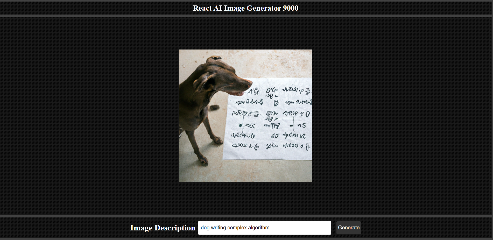

# OpenAI React Image Generator

Image generator based on anything user types. Built with Node.js, OpenAI, React, and Redux.

See image below. user input = "dog writing complex algorithm".

P.S. yes dogs can code

